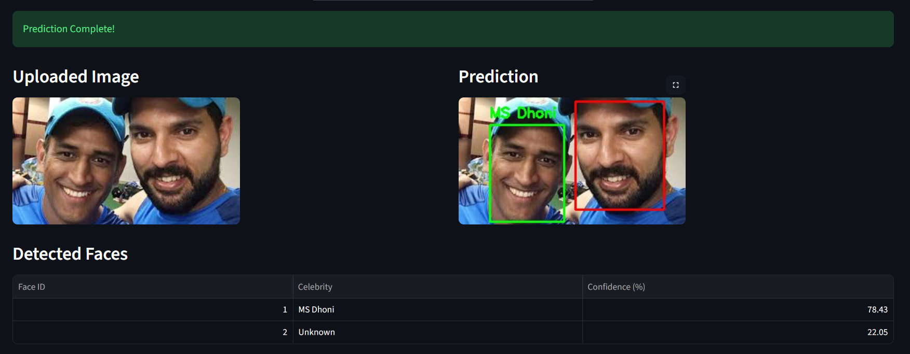
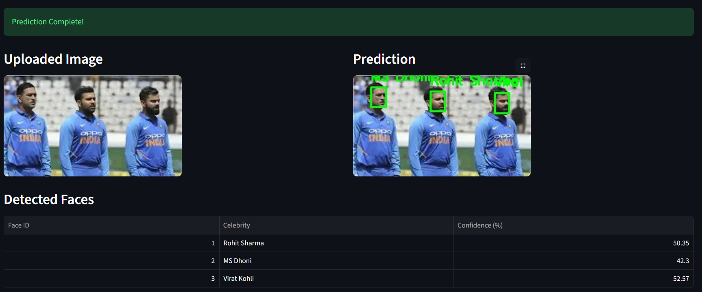
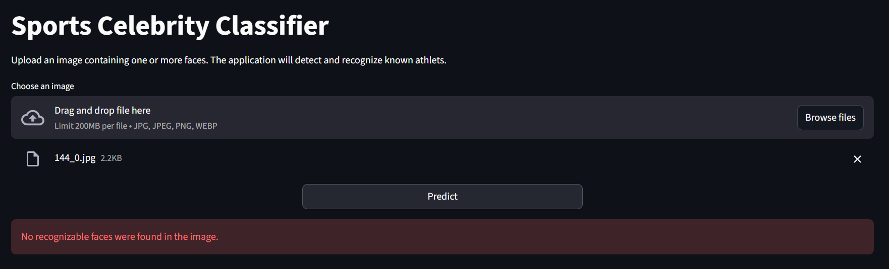
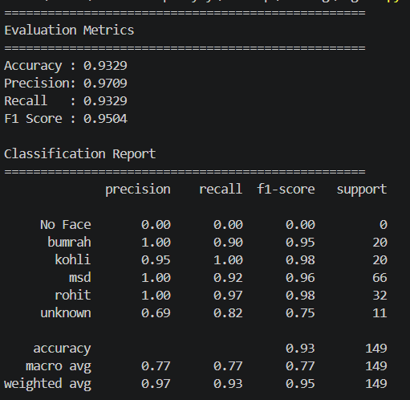
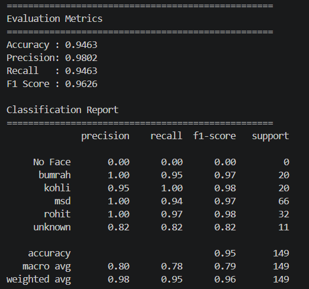

# 🏏 Sports Celebrity Classifier

A deep learning-based computer vision application that detects and recognizes Indian cricket celebrities from uploaded images. The system combines **YOLOv8 Face Detection** with **ArcFace (InsightFace)** embeddings to identify known celebrities while labeling unseen individuals as **Unknown**.

The application supports multiple faces in a single image, displays confidence scores, draws bounding boxes around detected faces, and is fully deployed using **FastAPI**, **Streamlit**, **Docker**, and **Hugging Face Spaces**.

🚀 **Live Demo:** https://riddhishupadhyay-sports-celeb-classifier.hf.space

---

## Features

- Detects multiple faces in a single image using **YOLOv8 Face Detector**
- Recognizes:
  - Virat Kohli
  - Rohit Sharma
  - MS Dhoni
  - Jasprit Bumrah
- Labels unseen individuals as **Unknown**
- Displays confidence score for every prediction
- Draws bounding boxes with predicted labels
- FastAPI backend for inference
- Interactive Streamlit frontend
- Fully containerized using Docker
- Deployed on Hugging Face Spaces
- Evaluated using multiple embedding strategies and threshold tuning

---

# Demo





---

# Project Architecture

```
                Uploaded Image
                       │
                       ▼
              Streamlit Frontend
                       │
               HTTP Request
                       │
                       ▼
                FastAPI Backend
                       │
        ┌──────────────┴──────────────┐
        ▼                             ▼
 YOLOv8 Face Detector          ArcFace Recognition
        │                             │
        └──────────────┬──────────────┘
                       ▼
             Celebrity Classification
                       │
                       ▼
        Annotated Image + Predictions
```

---

# Tech Stack

### Languages

- Python

### Backend

- FastAPI
- Uvicorn

### Frontend

- Streamlit

### Deep Learning

- YOLOv8 Face Detection
- ArcFace (InsightFace)

### Machine Learning

- Cosine Similarity
- Scikit-learn

### Computer Vision

- OpenCV
- Pillow

### Deployment

- Docker
- Hugging Face Spaces

---

# Folder Structure

```text
sports-celeb-classifier/
│
├── app.py
├── streamlit_app.py
├── predict_image.py
├── recognize_face.py
├── generate_embeddings.py
│
├── models/
│   └── yolo/
│       └── yolov8n-face.pt
│
├── data/
│   └── embeddings/
│       └── face_database.pkl
│
├── Dockerfile
├── start.sh
├── requirements.txt
└── README.md
```

---

# Model Evaluation

Two face recognition strategies were evaluated using a **cosine similarity threshold of 0.35**.

## Strategy 1 — Average Embedding

A single representative embedding was generated for each celebrity by averaging embeddings extracted from multiple training images.

### Performance



| Metric | Score |
|---------|-------|
| Accuracy | **93.29%** |
| Precision | **97.09%** |
| Recall | **93.29%** |
| F1 Score | **95.04%** |

### Classification Report

| Class | Precision | Recall | F1-score |
|------|----------:|-------:|---------:|
| Virat Kohli | 0.95 | 1.00 | 0.98 |
| Rohit Sharma | 1.00 | 0.97 | 0.98 |
| MS Dhoni | 1.00 | 0.92 | 0.96 |
| Jasprit Bumrah | 1.00 | 0.90 | 0.95 |
| Unknown | 0.69 | 0.82 | 0.75 |

---

## Strategy 2 — Individual Embeddings (Deployed Model)

Instead of averaging embeddings, embeddings from every training image were stored individually. During inference, the maximum cosine similarity across all stored embeddings was used for recognition.

### Performance



| Metric | Score |
|---------|-------|
| Accuracy | **94.63%** |
| Precision | **98.02%** |
| Recall | **94.63%** |
| F1 Score | **96.26%** |

### Classification Report

| Class | Precision | Recall | F1-score |
|------|----------:|-------:|---------:|
| Virat Kohli | 0.95 | 1.00 | 0.98 |
| Rohit Sharma | 1.00 | 0.97 | 0.98 |
| MS Dhoni | 1.00 | 0.94 | 0.97 |
| Jasprit Bumrah | 1.00 | 0.95 | 0.97 |
| Unknown | 0.82 | 0.82 | 0.82 |

---

# Performance Comparison

| Metric | Average Embedding | Individual Embeddings |
|--------|------------------:|----------------------:|
| Accuracy | 93.29% | **94.63%** |
| Precision | 97.09% | **98.02%** |
| Recall | 93.29% | **94.63%** |
| F1 Score | 95.04% | **96.26%** |

---

# Threshold Selection

The cosine similarity threshold was experimentally tuned using multiple values.

A threshold of **0.35** achieved the best trade-off between:

- Correctly recognizing known celebrities
- Reducing false positives
- Improving recognition of unknown faces

Therefore, **0.35** was selected as the deployment threshold.

---

# Key Findings

- Individual embeddings consistently outperformed average embeddings.
- Overall accuracy improved from **93.29%** to **94.63%**.
- Weighted F1-score improved from **95.04%** to **96.26%**.
- Recognition of **Unknown** individuals improved significantly (F1-score increased from **0.75** to **0.82**).
- Individual embeddings preserve facial variations caused by pose, lighting, facial expressions and camera angle more effectively than averaged embeddings.

Based on these observations, the deployed application uses the **Individual Embedding** strategy.

---

# Installation

Clone the repository

```bash
git clone https://github.com/RiddhishUpadhyay/sports-celeb-classifier.git
```

Move into the project directory

```bash
cd sports-celeb-classifier
```

Install dependencies

```bash
pip install -r requirements.txt
```

Run the application

```bash
bash start.sh
```

---

# Future Improvements

- Support additional sports personalities
- Real-time webcam inference
- Video processing
- Face tracking
- Larger celebrity database
- Model quantization for faster inference
- User authentication and prediction history

---

# Deployment

The project is fully containerized using **Docker** and deployed on **Hugging Face Spaces**.

---

# Author

**Riddhish Upadhyay**

GitHub: https://github.com/RiddhishUpadhyay
